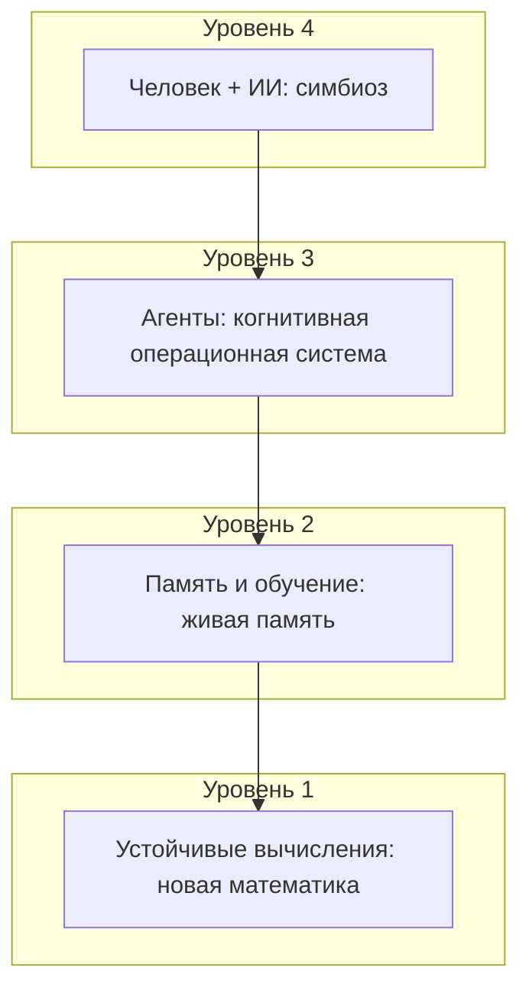
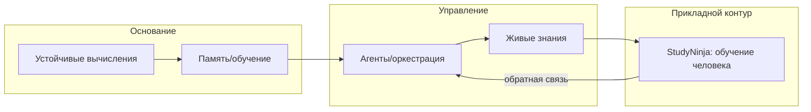

<!-- Profile README for @AndrewHakmi -->

# 👋 Привет! Я Тихонов Андрей Викторович

Я — основатель и визионер **XTeam.Pro** и **StudyNinja**. Делаю продукты и исследования на стыке **ИИ, образования, распределённых систем и вычислительной устойчивости**.

- 📍 Москва
- 🧩 Фокус: **MAGIC Ecosystem** + прикладной контур **StudyNinja**
- 🛠️ Стиль работы: от видения → к архитектуре → к воспроизводимому MVP → к метрикам качества

**Быстрые ссылки:**
[StudyNinja](https://github.com/XTeam-Pro/StudyNinja-Eco) · [Balansis](https://github.com/XTeam-Pro/Balansis) · [MagicBrain](https://github.com/XTeam-Pro/MagicBrain) · [XTeam.Pro](https://xteam.pro) · [Telegram](https://t.me/MessirWoland)

<b>🔗 Ещё ссылки (как было в исходном профиле)</b>

- https://github.com/andrewhakmi/vilaviai
- https://github.com/andrewhakmi/vilaviai-api
- https://github.com/andrewhakmi/studyninja
- https://github.com/andrewhakmi/studyninja-api

---

## 🌌 Моё стратегическое видение (коротко)
Я строю экосистему, где человек и ИИ становятся **единым когнитивным контуром**: ИИ помогает учиться, работать и развивать системы — а система учится на взаимодействии с человеком.

> **Тезис:** AGI не “строится как одна модель” — он **выращивается** как распределённая когнитивная экосистема.

### 🗺️ Карта (из визионерской схемы) — в одном взгляде

### 🧩 Как это связано со мной «в реальной жизни»
- **Balansis / ACT** — про устойчивые вычисления (не ломаться на “краях” и нулевых случаях)
- **MagicBrain** — про память/обучение как процесс активации и перестройки
- **MetaAgent** — про агентов как “операционную систему” (роли, инструменты, контроль качества)
- **StudyNinja** — прикладной полигон, где всё это проверяется на живом обучении

---

## 🏗️ Чем я занимаюсь сейчас (актуально)
- 🧠 **StudyNinja (платформа)**: архитектура, качество ИИ‑репетитора, метрики/QA, устойчивость и наблюдаемость
- 🧰 **StudyNinja-Eco (оркестрация)**: окружения dev/test/stage/prod, compose‑слои, мониторинг, воспроизводимые деплои
- 📱 **StudyNinja Mobile**: Flutter‑приложение (Clean Architecture), развитие веток dev/фич
- ⚖️ **Balansis**: математическая база и формальные доказательства (Lean4)
- 🧬 **MagicBrain**: исследование нейроморфной памяти/обучения (долгосрочный трек)

---

## 🧠 Проекты

### 🎓 StudyNinja — образовательная платформа (AI Tutor + траектории)
Что важно для меня в StudyNinja:
- честная проверка знаний (без “придирок ради придирок”)
- поддерживающий тон
- устойчивость к плохой сети/крайним случаям
- измеримость качества через тесты и телеметрию

**Репозитории (часть может быть internal/private):**
- StudyNinja Eco (orchestration): https://github.com/XTeam-Pro/StudyNinja-Eco
- StudyNinja API: https://github.com/XTeam-Pro/StudyNinja-API
- StudyNinja UIKit: https://github.com/XTeam-Pro/StudyNinjaUIKit
- StudyNinja Mobile: https://github.com/XTeam-Pro/StudyNinja-Mobile

<b>📌 Что внутри (очень коротко)</b>

- API: auth/подписки/уроки/прогресс, интеграция с KB, события качества
- UIKit: пользовательский опыт обучения, роадмапы, уроки, платежи
- Eco: оркестрация сервисов, слои compose, promotion dev→stage→prod
- Mobile: Flutter‑клиент как интерфейс человека к системе

### 🧩 XTeam.Pro — команда/сообщество инженеров и исследователей
XTeam.Pro — это место, где мы собираем и выращиваем людей, которые хотят строить сложные системы: от инфраструктуры и продуктов до новых вычислительных идей.

- Сайт: https://xteam.pro

### ⚖️ Balansis — вычислительная устойчивость (ACT)
Идея простая: не “чинить симптомы” численных проблем, а **менять основу вычислений**, чтобы пограничные случаи перестали ломать системы.

- Репозиторий: https://github.com/XTeam-Pro/Balansis

### 🧬 MagicBrain — память/обучение как живой процесс
Долгосрочная линия: перейти от “хранения данных” к **активации воспоминаний** и непрерывному обучению.

- Репозиторий: https://github.com/XTeam-Pro/MagicBrain

---

## 🧭 Мои роли
- **R&D Chief** — исследование и проектирование новых парадигм
- **Senior Developer** — архитектура, качество, производственная надёжность
- **Project/Product Manager** — стратегия, приоритизация, доставка результата

---

## 🔥 Ключевые направления
- 🤖 Мультиагентные системы и “агенты как операционная система”
- 🎓 AI‑образование: диагностика → траектория → урок → удержание
- ⚖️ Вычислительная устойчивость (ACT) и формализация
- 🧠 Человеко‑машинный контур: доверие, объяснимость, качество, безопасность

---

## 🧩 Интерактив: как я мыслю про систему

<b>🧱 Слои экосистемы и прикладной контур</b>

<b>🚀 Как превращаю видение в результат (процесс)</b>

1) Формулирую “North Star” (что меняет мир)
2) Разбиваю на уровни/слои (что должно существовать)
3) Строю воспроизводимый MVP (запуск/деплой/метрики)
4) Ввожу тесты качества (честность, тон, стабильность)
5) Итерации: быстрее, безопаснее, понятнее

---

## 📌 Контакты
📧 Email: [andrew@xteam.pro](mailto:andrew@xteam.pro)  
🌐 Website: https://xteam.pro  
📱 Telegram: https://t.me/MessirWoland

---

**Давайте делать будущее руками.**
