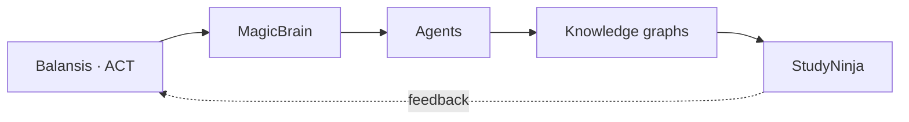

# Andrew Tikhonov

**Founder & R&D Chief — [XTeam.Pro](https://xteam.pro) · [StudyNinja](https://studyninja.ru)**

R&D leadership · systems engineering · product & delivery

*AGI is not built. It is grown — a distributed cognitive ecosystem in which humans and machines close a single cognitive loop.*

## Thesis

**Human–Machine AGI Core Symbiosis** is an engineering program — the **MAGIC Cognitive OS**, a layered ecosystem architecture: each layer is a real project, and the applied loop feeds back into the layers beneath it.

```mermaid
flowchart LR
    B["Balansis · ACT"] --> M["MagicBrain"]
    M --> A["Agents"]
    A --> K["Knowledge graphs"]
    K --> S["StudyNinja"]
    S -. feedback .-> B
```

One stack, five layers.

## What I build

- **[StudyNinja](https://studyninja.ru)** — adaptive learning platform: an AI tutor over knowledge-graph learning trajectories · FastAPI / React / Flutter · Russian state exam (OGE/EGE) prep · product org: [StudyLabPro](https://github.com/StudyLabPro)
- **[XTeam.Pro](https://xteam.pro)** — AI engineering & R&D company: multi-agent systems, predictive analytics, delivery of complex AI systems · engineering org: [XTeam-Pro](https://github.com/XTeam-Pro)

## Current R&D

- **Agentic runtimes** → ANU
- **Graph-driven adaptive learning** → StudyNinja · KnowledgeBaseAI
- **Verified numerics** → Balansis
- **Memory & continual learning** → MagicBrain

## Deep tech

| System | What it is | Status |
|---|---|---|
| [**ANU** · Agent Native Universe](https://github.com/AndrewHakmi/agent-native-universe) | Runtime for self-organizing NanoAgent networks: negotiated links, encrypted autonomous mesh, Byzantine agreement. *The live graph is the system.* | `open · MIT` |
| **KnowledgeBaseAI** | Neo4j knowledge-graph service: the curriculum graphs and adaptive trajectories beneath StudyNinja | `private` |
| **Balansis** | Computational-stability library: compensated sum · dot · softmax · matmul (ACT), with formal proofs in Lean4 | `research · private` |
| **MagicBrain** | ML research library: memory as activation, continual learning | `research · private` |

## Research interests

`human–machine intelligence` · `distributed cognitive ecosystems` · `agentic systems` · `knowledge graphs` · `adaptive education` · `formally verified computation`

## Stack

- **Languages** — Python · TypeScript · Dart
- **Systems** — FastAPI · React · Node.js · Flutter · LangGraph / LLM agent orchestration
- **Data** — PostgreSQL · Neo4j · Qdrant · Redis · RabbitMQ · ClickHouse
- **Infra** — Docker · Kubernetes · Helm · Traefik · Grafana / Loki
- **Proofs** — Lean4

---

Grown, not built.

